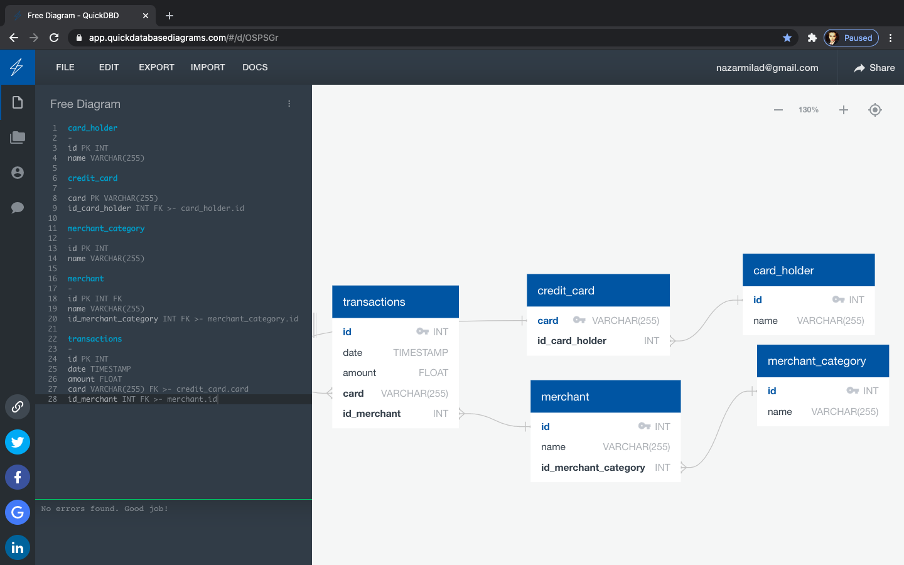

# Unit 7 Homework Assignment: Looking for Suspicious Transactions

*[Credit Card Fraudster by Richard Patterson](https://www.flickr.com/photos/136770128@N07/42252105582/) | [Creative Commons Licensed](https://creativecommons.org/licenses/by/2.0/)*

## Background

In this Homework I will be investigating Fraud on different employees using their Identification Numbers provided by the employer. I will apply my new SQL skills to analyze historical credit card transactions and consumption patterns in order to identify possible fraudulent transactions.

**This could be done through following the below three steps:**

1. [Data Modeling](#Data-Modeling):
2. [Data Engineering](#Data-Engineering):
3. [Data Analysis](#Data-Analysis):

---

**My Submissions and Analyzations are explained in the below files:**

* An image file of your ERD in DATA Folder.

* A `.sql` file of your table schemata.

* A Jupyter Notebook for the visual data analysis and the challenge.

* A repository 